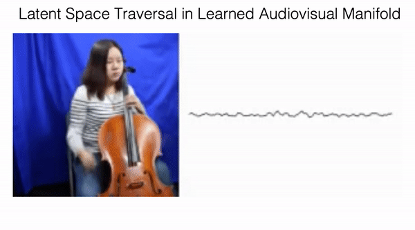

# Learning Signal-Agnostic Manifolds of Neural Fields

This is the uncleaned code for the paper [Learning Signal-Agnostic Manifolds of Neural Fields](https://arxiv.org/abs/2111.06387). The
cleaned code will be cleaned shortly.

<p align="center">
  
</p>


## Downloading Data

Please utilize the following [link](https://www.dropbox.com/s/601riehyvyw8uz2/data.tar.gz?dl=0) to download the underlying models and data used in the paper and extract it in the root directory. Please download
the 3D shape dataset from [here](https://github.com/czq142857/IM-NET).


## Demo

The underying audiovisual manifold illustrated in the paper may be constructed by utilizing the following command

```
python experiment_scripts/audiovisual_manifold_interpolate.py --experiment_name=audiovis_demo --checkpoint_path log_root/audiovis_demo/checkpoints/model_70000.pth
```

## Training Different Signal Manifolds

Please utilize the following command to train an image manifold

```
python experiment_scripts/train_autodecoder_multiscale.py --experiment_name=celeba 
```

Please utilize the following command to train a 3D shape manifold

```
python experiment_scripts/train_imnet_autodecoder.py --experiment_name=imnet 
```

Please utilize the following command to train an audio manifold

```
python experiment_scripts/train_audio_autodecoder.py --experiment_name=audio 
```

Please utilize the following command to train an audiovisual manifold

```
python experiment_scripts/train_audiovisual_autodecoder.py --experiment_name=audiovisual
```


## Citing our Paper

If you find our code useful for your research, please consider citing 

``` 
@inproceedings{du2021gem,
  title={Learing Signal-Agnostic Manifolds of Neural Fields},
  author={Du, Yilun and Collins, M. Katherine and and Tenenbaum, B. Joshua
  and Sitzmann, Vincent},
  booktitle={Advances in Neural Information Processing Systems},
  year={2021}
}
```
